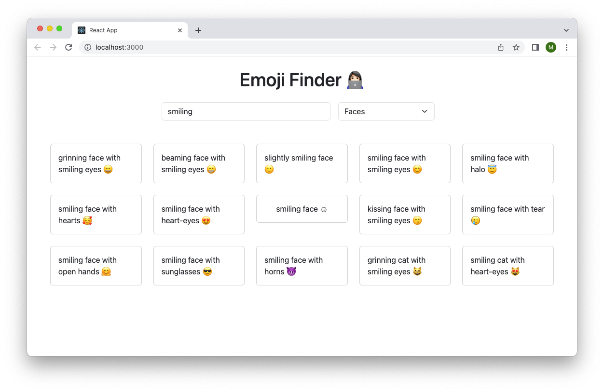

# Emoji Finder

You can search emoji by keywords and/or category.

## How to Run

In the project directory, you can run: `npm start`.  
Open [http://localhost:3000](http://localhost:3000) to view it in your browser.

## Side Note

- This project was bootstrapped with [Create React App](https://github.com/facebook/create-react-app).  

- For emoji search, [this API](https://api-ninjas.com/api/emoji) is used.
